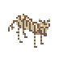
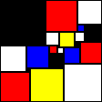
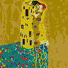
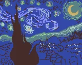
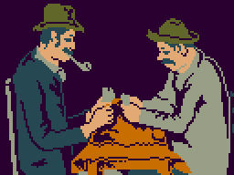
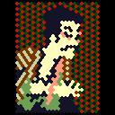

# Fixture images
* `animated.GIF`
  
  
* `animated.PNG`
  
  
* `animated.WEBP`
  
  
* `still.GIF`
  
  
* `still.PNG`
  
  
* `still.WEBP`
  
  
* `still.JPG`
  
  
* `still.JXR(JPEG-XR)`
  
  
* `still.BMP`
  
  
* `still.PSD`
  
  
* `still.TIF`
  
  

# Usage
## Via npm
```bash
$ npm install fixture-images --save-dev
```
```js
var animated= require('fixture-images').animated;

console.log(animated.gif);// [47,49,46,38,39,61,...]
```

## Via bower
```bash
$ bower install fixture-images --save-dev
```
```html
<script src="/bower_components/fixture-images/all.min.js"></script>
<script>
var animated= fixtureImages.animated;

console.log(animated.gif);// [47,49,46,38,39,61,...]
</script>
```
## Via http/https
### in Node.js
```bash
$ npm install request --save-dev
```
```js
var url= 'http://cdn.rawgit.com/59naga/fixture-images/master/animated.GIF';

var request= require('request');
request.get({url:url,encoding:null},function(error,response,buffer){
  console.log(buffer);// [47,49,46,38,39,61,...]
});
```

### in Browser
```html
<script>
var url= 'https://cdn.rawgit.com/59naga/fixture-images/master/animated.GIF';

var xhr= new XMLHttpRequest;
xhr.open('GET',url,true);
xhr.responseType= 'arraybuffer';
xhr.send();

xhr.onload= function(){
  var binary= new Uint8Array(xhr.response);
  var blob= new Blob([binary],{type:'image/gif'});
  window.open(URL.createObjectURL(blob));
}
</script>
```

License
---
[MIT][License]

[License]: http://59naga.mit-license.org/

[sauce-image]: http://soysauce.berabou.me/u/59798/pixel.svg
[sauce]: https://saucelabs.com/u/59798
[npm-image]:https://img.shields.io/npm/v/pixel.svg?style=flat-square
[npm]: https://npmjs.org/package/pixel
[travis-image]: http://img.shields.io/travis/59naga/pixel.svg?style=flat-square
[travis]: https://travis-ci.org/59naga/pixel
[coveralls-image]: http://img.shields.io/coveralls/59naga/pixel.svg?style=flat-square
[coveralls]: https://coveralls.io/r/59naga/pixel?branch=master
